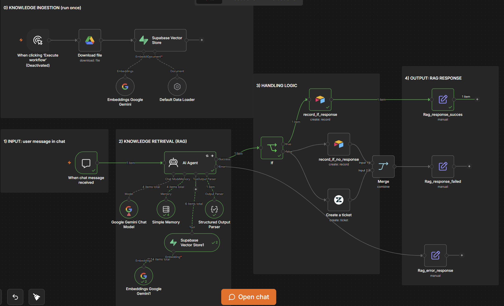
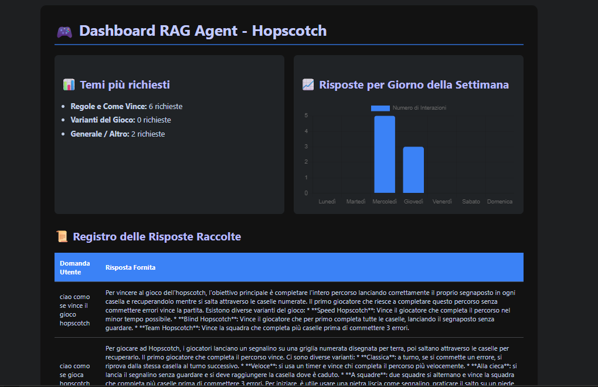

# 🦘 Hopscotch RAG Agent (n8n)

Chatbot RAG ("Jozu") that answers questions about the rules of Hopscotch, built with n8n. Uses a Supabase vector store for knowledge retrieval, logs every interaction to Airtable, and opens a Zendesk ticket automatically when it can't answer.

Built as part of the **Ready 4 It — Automazione e AI** learning path.

## What it does

```
Chat message → AI Agent (Gemini) → searches Supabase vector store
                       ↓
        Structured output: { answered, response, summary }
                       ↓
              answered = true  →  log to Airtable
              answered = false →  log to Airtable + open Zendesk ticket
                       ↓
                Clean response back to the user
```

It also handles technical errors gracefully: if the AI Agent fails (e.g. API rate limit), it retries automatically and falls back to a fixed apology message instead of breaking the chat.

## Architecture



1. **Knowledge ingestion** (run once) — downloads a `.txt` file from Google Drive, splits it into chunks, generates embeddings with Gemini, and stores everything in Supabase.
2. **Chat input** — a public n8n Chat Trigger receives the user's message.
3. **Knowledge retrieval (RAG)** — the AI Agent searches the Supabase vector store and returns a structured JSON response via a Structured Output Parser (no fragile text parsing).
4. **Handling logic** — an `If` node branches based on whether an answer was found, logging to Airtable either way and opening a Zendesk ticket when it wasn't.
5. **Output** — the final response is sent back to the user in the chat.



## Bonus: HTML dashboard (extra mile)

A second, independent workflow (`Dashboard_workflow_sanitized.json`) exposes a public webhook that reads all logged interactions from Airtable and returns a self-contained HTML dashboard: most requested topics, a bar chart of interactions per day of the week (via Chart.js), and a full log table of questions/answers. No AI involved here — just a `Code` node generating HTML from the Airtable data.

```
GET /webhook/agentstats → Search records (Airtable) → Code (builds HTML) → Respond to Webhook
```

### Architecture decision: why no AI Agent in the dashboard flow

The course suggested placing an AI Agent between the data fetch and the response, having it generate the HTML dynamically. This repo intentionally does it differently, with deterministic JavaScript (`Code` node) instead.

Reasoning:
- **Token cost scales with data volume.** An AI Agent would need the full dataset in its context on every webhook call. With a handful of records this is negligible — with hundreds/thousands it becomes expensive and slow for something that should be instant.
- **Reliability.** Regex/code-based extraction always produces the same structure. An LLM generating raw HTML on every request introduces a (small but real) chance of malformed output, especially as the input grows.
- **No added value for this specific task.** Formatting fixed fields into HTML/a chart is pure structure, not something that benefits from a model's judgment.

Where an AI Agent *would* add real value in this same flow: generating a short, human-readable insight on top of the already-processed data (e.g. *"most questions this week were about game rules, not variants"*) — a hybrid approach where deterministic code still owns the structure, and the LLM only contributes interpretation it's actually suited for.

### Human-in-the-loop

The main RAG flow isn't fully autonomous by design. When the agent can't find an answer (`answered: false`), it doesn't just apologize and stop — it opens a Zendesk ticket so a real person picks up where the AI left off. The AI handles the easy, well-covered cases; a human handles the rest. This was a deliberate production decision, not a fallback added as an afterthought.

## Requirements

You'll need free accounts for:

- [n8n](https://n8n.io) (cloud or self-hosted)
- [Supabase](https://supabase.com) — vector store + Postgres
- [Google AI Studio](https://aistudio.google.com) — Gemini API key
- [Google Drive](https://drive.google.com) — to host the knowledge source file
- [Airtable](https://airtable.com) — interaction logging
- [Zendesk](https://www.zendesk.com) — support ticket creation

## Setup

1. Import `Rag_agent_sanitized.json` into your n8n instance.
2. Upload `hopscotch_rules.txt` (included in this repo) to your Google Drive — this is the knowledge source file used for the vector store.
3. Create credentials in n8n for: Google Drive OAuth2, Supabase API, Google Gemini (PaLM) API, Airtable Personal Access Token, Zendesk API. Reconnect each node to the credential you just created (the JSON ships with placeholder credential IDs).
4. **Supabase**: create a table called `documents` with the schema expected by the n8n Supabase Vector Store node (id, content, metadata, embedding). Enable the `pgvector` extension if not already active.
5. **Airtable**: create a base with a table called `Interactions` with these fields:
   - `Question` (single line text)
   - `Answer` (long text)
   - `Answered` (checkbox)
   - `Date` (date)
   - `Session ID` (single line text)
6. Replace the placeholder IDs in the JSON (or directly in the n8n UI after import):
   - `YOUR_GOOGLE_DRIVE_FILE_ID` → the file ID of `hopscotch_rules.txt` once uploaded to your Drive
   - `YOUR_AIRTABLE_BASE_ID` / `YOUR_AIRTABLE_TABLE_ID` → your Airtable base/table
   - `YOUR_WEBHOOK_ID` → n8n regenerates this automatically on import, usually no action needed
7. Run the knowledge ingestion flow once (manual trigger) to populate Supabase.
8. Activate the chat flow and test it.

## Notes

- The Zendesk node is fully configured (parametrized JSON body with subject, comment, and requester) but ticket creation wasn't verified against a live Zendesk instance in this repo's testing.

## Tech stack

`n8n` · `Supabase (pgvector)` · `Google Gemini` · `Airtable` · `Zendesk`
